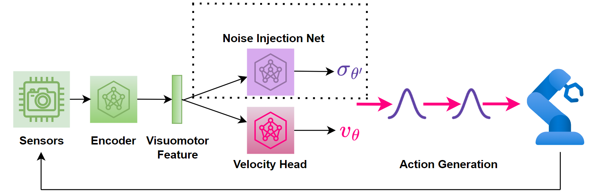
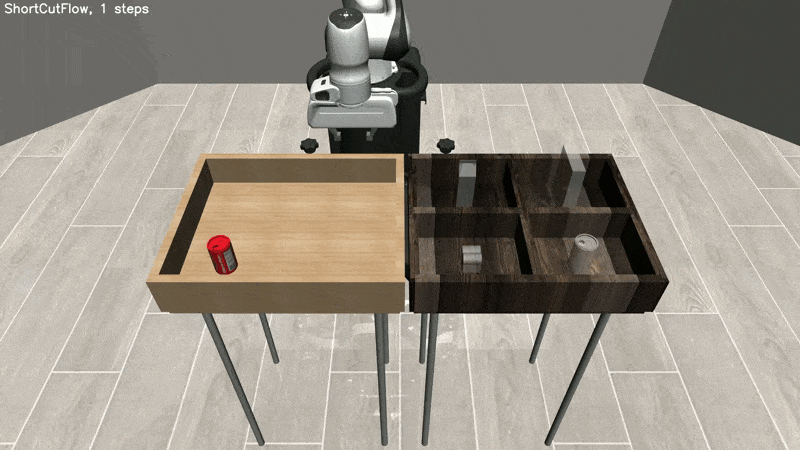
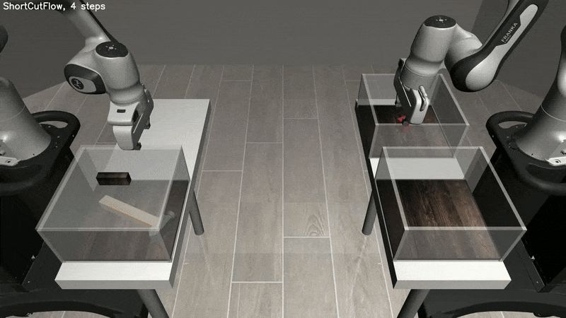

# ReinFlow: Fine-tuning Flow Matching Policy with Online Reinforcement Learning

### 💐 Paper accepted at <span style="color:red;">NeurIPS 2025</span></span>

[Tonghe Zhang](https://tonghe-zhang.github.io/)$^1$, [Chao Yu](https://nicsefc.ee.tsinghua.edu.cn/people/ChaoYu)$^{2,3}$, [Sichang Su](https://destiny000621.github.io/)$^4$, [Yu Wang](https://nicsefc.ee.tsinghua.edu.cn/people/YuWang)$^2$

$^1$ Carnegie Mellon University  $^2$ Tsinghua University $^3$ Beijing Zhongguancun Academy  $^4$ University of Texas at Austin

<div align="center">
  <a href="https://reinflow.github.io/" target="_blank">
    
  </a>
  <a href="https://github.com/ReinFlow/ReinFlow/tree/release/docs" target="_blank">
    
  </a>
  <a href="https://neurips.cc/virtual/2025/poster/119473" target="_blank">
    
  </a>
  <br>
   <a href="https://arxiv.org/abs/2505.22094" target="_blank">
    
  </a>
  <a href="https://huggingface.co/datasets/ReinFlow/ReinFlow-data-checkpoints-logs/" target="_blank">
    
  </a>
  <a href="https://wandb.ai/reinflow/projects" target="_blank">
    
  </a>
</div>

<br>

<!-- schematic: -->
<p align="center">
  
</p>

<p align="center">
  
  
</p>

<hr>


<!-- mini table of contents: -->
<p align="center">
  <a href="#rocket-installation">Installation</a> |
  <a href="#rocket-quick-start-reproduce-our-results">Quick Start</a> |
  <a href="#rocket-implementation-details">Implementation Details</a> |
  <a href="#rocket-adding-your-own-dataset-or-environment">Add Dataset/Environment</a> <br>
  <a href="#rocket-debug-aid-and-known-issues">Debug & Known Issues</a> |
  <a href="#license">License</a> |
  <a href="#acknowledgement">Acknowledgement</a> |
  <a href="#cite-our-work">Citation</a>
</p>

This is the official implementation of _"ReinFlow: Fine-tuning Flow Matching Policy with Online Reinforcement Learning"_.  

If you like our work, it will be wonderful if you give us a star **:star:**!

## :loudspeaker: News
* [2025/11/28]  **🔥 ReinFlow now supports fine-tuning GR00T VLA models from NVIDIA.** Check it out at [**RLinf-GR00T-N1.5**](https://rlinf.readthedocs.io/en/latest/rst_source/examples/gr00t.html)
* [2025/11/7]  Update limitation section
* [2025/11/5]  Update tips on hyperparameter tuning. 
* [2025/11/2] 🔥 **We scaled up ReinFlow to fine-tune VLA models such as $\pi_0$ and $\pi_{0.5}$.**  
  **The code and checkpoint for the LIBERO environment are available at [**RLinf-pi0**](https://rlinf.readthedocs.io/en/latest/rst_source/examples/pi0.html).**
  **A technical report including results on LIBERO, MetaWorld, ManiSkill/Simpler is available at** $\pi_{\texttt{RL}}$ [**Online RL Fine-tuning for Flow-based Vision-Language-Action Models: arXiv:2510.25889**](https://arxiv.org/abs/2510.25889)).
* [2025/09/18] ReinFlow paper is accepted at [NeurIPS 2025](https://neurips.cc/virtual/2025/poster/119473). 
* [2025/08/18] All training metrics (losses, reward, etc) released in [WandB](https://wandb.ai/reinflow/projects) to help you reproduce our results. 
* [2025/07/30] Fixed the rendering bug in Robomimic. Now supports rendering at 1080p resolution. 
* [2025/07/29] Add tutorial on how to record videos during evaluation in the [docs](docs/ReproduceExps.md)
* [2025/06/14] Updated webpage for a detailed explanation to the algorithm design.
* [2025/05/28] Paper is posted on [arXiv](https://arxiv.org/abs/2505.22094)!


## 🚀 About ReinFlow


**ReinFlow** is a flexible **policy gradient framework** for fine-tuning **flow matching policies** at **any denoising step**.

How does it work?  
👉 First, train flow policies using **imitation learning** (behavior cloning).  
👉 Then, fine-tune them with **online reinforcement learning** using ReinFlow!

🧩 **Supports**:

- ✅ 1-Rectified Flow  
- ✅ Shortcut Models  
- ✅ Any other policy defined by ODEs (in principle)

📈 **Empirical Results**: ReinFlow achieves strong performance across a variety of robotic tasks:
- 🦵 Legged Locomotion (OpenAI Gym)  
- ✋ State-based manipulation (Franka Kitchen)  
- 👀 Visual manipulation (Robomimic)

🧠 **Key Innovation**: ReinFlow trains a **noise injection network** end-to-end:
- ✅ Makes policy probabilities tractable, even with **very few denoising steps** (e.g., 4, 2, or 1)  
- ✅ Robust to discretization and Monte Carlo approximation errors

Learn more on our 🔗 [project website](https://reinflow.github.io/) or check out the [arXiv paper](https://arxiv.org/abs/2505.22094). 

## :rocket:  Installation
Please follow the steps in [installation/reinflow-setup.md](./installation/reinflow-setup.md).

## :rocket: Quick Start: Reproduce Our Results
To fully reproduce our experiments, please refer to [ReproduceExps.md](docs/ReproduceExps.md). 

To download our training data and reproduce the plots in the paper, please refer to [ReproduceFigs.md](docs/ReproduceFigs.md).

## :rocket: Implementation Details
Please refer to [Implement.md](docs/Implement.md) for descriptions of key hyperparameters of FQL, DPPO, and ReinFlow.

## :rocket: Adding Your Own Dataset or Environment
Please refer to [Custom.md](docs/Custom.md).

## :rocket: Debug Aid and Known Issues
Please refer to [KnownIssues.md](docs/KnownIssues.md) to see how to resolve errors you encounter.

## :rocket: Tips on Hyperparameter Tuning
After training flow policies with RL in multiple benchmarks (OpenAI Gym, Franka Kitchen, Robomimic, LIBERO, ManiSkill, MetaWorld) and scaling model size from 3M to 3B, 
we discover that these hyperparameters are critical to RL's success, especially in visual manipulation from sparse reward: 
* `SFT success rate`. RL cannot train visual manipulation policies easily from scratch, so try to optimize your SFT success rate before starting RL. The stronger your SFT is, the easier it will be for RL. 
* `Noise level`. When the SFT success rate is low, tune down noise to [0.04, 0.10] or [0.05, 0.12] to avoid too much erroneous behaviors in early-stage exploration.
  When the SFT success rate is high, relax the noise logvariance to [0.08, 0.16] is usually a good practice. 
* `Entropy coefficient`. Turn it off first. When pocliy struggles to improve, add a small coefficient of 0.005 may help. When the policy is small and the problem is simple (dense reward, low-dim input),
use larger entropy coefficient. Otherwise be cautious of increasing this constant.
* `Critic warmup`. The stronger your SFT checkpoint is, the more you need a critic warmup. Try to pick the correct critic network architecture and add some rounds of warmup before policy gradient ascent. Try to make the critic loss decrease smoothly after the warmup phase, and keep a keen eye on the explained variance--it should quickly increase to a higher level. However, even without warmup, ReinFlow should be able to increase success rate eventually, but that usually slows down convergence. 

## :rocket: Limitation and Caveats
Based on community feedback, we have added a limitations section to highlight the shortcomings of our algorithm and note important caveats. We hope this discussion will inspire future research.
* ReinFlow may not be an optimal method to train RL agents from scratch. Our method is designed for fine-tuning purposes, not pre-training.

## :star: Todo
- [x] Release pi0, pi0.5 fine-tuning results.
- [x] Release WandB metrics
- [x] Release docs
- [x] Release checkpoints
- [x] Release codebase

## License
This repository is released under the MIT license. See [LICENSE](LICENSE). 
If you use our code, we appreciate it if you paste the license at the beginning of the script. 

## Acknowledgement
This repository was developed from multiple open-source projects. Major references include:  
- [TorchCFM, Tong et al.](https://github.com/atong01/conditional-flow-matching): Conditional flow-matching repository.  
- [Shortcut Models, Francs et al.](https://github.com/kvfrans/shortcut-models): One-step Diffusion via Shortcut Models. 
- [DPPO, Ren et al.](https://github.com/irom-princeton/dppo): DPPO official implementation.  

We also thank our collaborators from the open-source RL infrastructure project [RLinf](https://github.com/RLinf/RLinf) for their generous support, which enabled scaling ReinFlow to models of up to 3 billion parameters across 320 highly randomized visual manipulation environments with thousands of object-scene-task-pose combinations. 

For more references, please refer to [Acknowledgement.md](docs/Acknowledgement.md).

## Cite our work
```bibtex
@misc{zhang2025reinflowfinetuningflowmatching,
    title={ReinFlow: Fine-tuning Flow Matching Policy with Online Reinforcement Learning},
    author={Tonghe Zhang and Chao Yu and Sichang Su and Yu Wang},
    year={2025},
    eprint={2505.22094},
    archivePrefix={arXiv},
    primaryClass={cs.RO},
    url={https://arxiv.org/abs/2505.22094},
}
```

## Star History
<div style="display: flex; justify-content: center; align-items: center; height: 100vh; width: 100%; margin: 0; padding: 0;">
    
</div>
