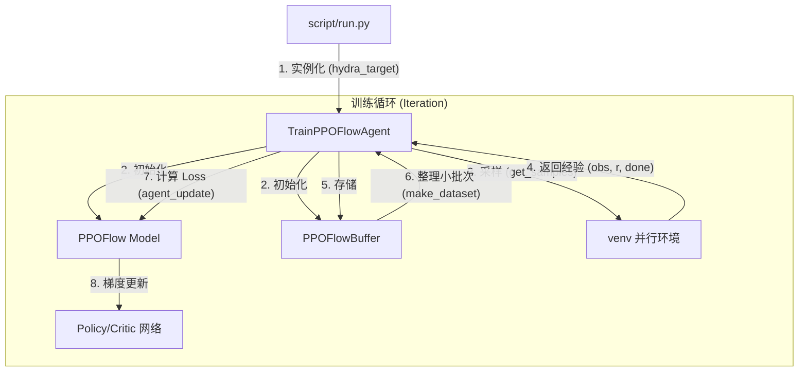

# ReinFlow 项目架构文档

ReinFlow 是基于 Flow Matching (FM) 和 Reinforcement Learning (RL) 的动作生成框架。本项目采用高度模块化的设计，结合 [Hydra](https://hydra.cc/) 配置系统实现算法与环境的灵活解耦。

## 1. 核心流程图

## 2. 模块职责说明

### 🚀 启动入口 (Entry Point)
*   **文件**: [run.py](file:///mnt/c/codes/flowmatching/ReinFlow/script/run.py)
*   **职能**: 解析命令行参数，加载 YAML 配置，动态构建 Agent 对象并启动训练。

### 🧠 训练指挥官 (Agent)
*   **文件**: [train_ppo_flow_agent.py](file:///mnt/c/codes/flowmatching/ReinFlow/agent/finetune/reinflow/train_ppo_flow_agent.py)
*   **类名**: `TrainPPOFlowAgent` (继承自 `TrainAgent`)
*   **职能**:
    *   管理环境 `venv` 的交互。
    *   调用模型生成动作并收集轨迹。
    *   计算优势函数 (GAE) 并触发模型权重更新。

### 📊 数据缓存 (Replay Buffer)
*   **文件**: [buffer.py](file:///mnt/c/codes/flowmatching/ReinFlow/agent/finetune/reinflow/buffer.py)
*   **类名**: `PPOFlowBuffer`
*   **职能**: 专门针对流模型设计的缓存，不仅存储传统的 RL 数据，还记录了 **Action Chains**（生成动作的 ODE 轨迹），这是计算 Flow Matching 概率路径的关键。

### ⚖️ 算法灵魂 (Model/Algorithm)
*   **文件**: [ppoflow.py](file:///mnt/c/codes/flowmatching/ReinFlow/model/flow/ft_ppo/ppoflow.py)
*   **类名**: `PPOFlow`
*   **职能**: 
    *   **推理**: 实现从高斯噪声到动作的 ODE 求解过程 (`get_actions`)。
    *   **训练**: 定义结合了 PPO 优化目标和 Flow Matching 损失的复合 Loss 函数 (`loss`)。

### 🕸️ 神经网络 (Network Architecture)
*   **文件**: [mlp_flow.py](file:///mnt/c/codes/flowmatching/ReinFlow/model/flow/mlp_flow.py)
*   **类名**: `FlowMLP`
*   **职能**: 定义具体的前向传播网络，用于预测流模型的速度向量场 $v(x_t, t, s)$。

## 3. 快速索引表

| 核心功能 | 核心类/函数 | 关键文件路径 |
| :--- | :--- | :--- |
| **训练主循环** | `TrainPPOFlowAgent.run` | `agent/finetune/reinflow/train_ppo_flow_agent.py` |
| **动作生成流程** | `PPOFlow.get_actions` | `model/flow/ft_ppo/ppoflow.py` |
| **PPO+FM 损失** | `PPOFlow.loss` | `model/flow/ft_ppo/ppoflow.py` |
| **ODE 速度场预测**| `FlowMLP` | `model/flow/mlp_flow.py` |
| **采样轨迹存储** | `PPOFlowBuffer` | `agent/finetune/reinflow/buffer.py` |
