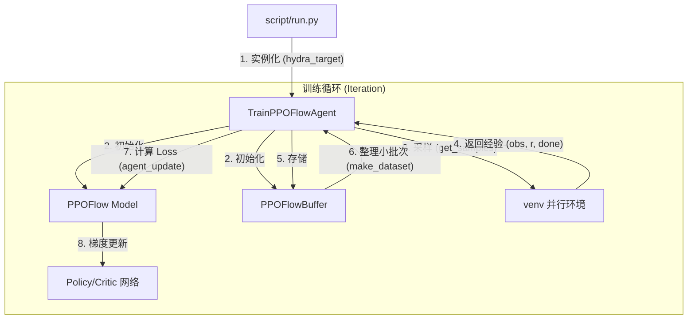

# ReinFlow 训练环境启动指南

在这个服务器（RTX 4090）上，我们已经成功跑通并验证了 ReinFlow 的三种主要虚拟环境。您在启动具体的实验时，只需要按照以下步骤**切换 config 的目录和名称**即可启动不同环境的并行训练：

### 1. 激活环境与路径 (每次新开终端必跑)
首先，我们需要激活已经安装好所有依赖的 `conda` 虚拟环境，并声明项目和数据的路径。

```bash
# 激活 Conda 环境
source ~/anaconda3/etc/profile.d/conda.sh
conda activate reinflow

# 导出挂载好的数据和日志路径 (重要！防止C盘被塞满，转移至挂载盘)
export REINFLOW_DIR="/mnt/c/codes/flowmatching/ReinFlow"
export REINFLOW_DATA_DIR="/mnt/d/assets/data"
export REINFLOW_LOG_DIR="/mnt/d/assets/log"
export PYTHONPATH=.
```

---

### 2. 启动主要的训练命令 (请根据需要选择环境)

所有的训练都是通过 `script/run.py` 配合 [Hydra](https://hydra.cc/) 配置系统进行启动的。要想切换虚拟环境，您只需要更改 `--config-dir` 指向的环境配置文件目录，以及 `--config-name` 指向的算法配置文件。

#### 方案 A：基于状态控制的 D4RL / Gym 运动环境 (如 Ant, Walker2d)
用于测试基础的连续控制能力。

```bash
python script/run.py \
    --config-dir=cfg/gym/finetune/ant-v2 \
    --config-name=ft_ppo_reflow_mlp \
    min_std=0.08 max_std=0.16 train.ent_coef=0.03 \
    wandb=null device=cuda:0 sim_device=cuda:0
```
> **修改环境**：如果想训练 Walker2d 等，只需将 `--config-dir=cfg/gym/finetune/ant-v2` 替换为 `cfg/gym/finetune/walker2d-medium-v2` 等存在于 `cfg/gym/finetune/` 下的文件夹即可。

#### 方案 B：多任务状态驱动机械臂 (Franka Kitchen)
用于证明策略处理多模态复杂任务分布的能力。Kitchen 环境通常搭配 `shortcut` 算法或特定的并行配置。

```bash
python script/run.py \
    --config-dir=cfg/gym/finetune/kitchen-mixed-v0 \
    --config-name=ft_ppo_shortcut_mlp \
    train.ent_coef=0.01 \
    wandb=null device=cuda:0 sim_device=cuda:0
```
> **修改环境**：可以替换目录为 `cfg/gym/finetune/kitchen-complete-v0` 等。

#### 方案 C：基于视觉 (视角图像输入) 的 Robomimic 操作任务
通过直接输入图像像素预测动作，这对于评估视觉泛化极其重要。(注：该环境自带极速的 EGL GPU 渲染引擎)

```bash
python script/run.py \
    --config-dir=cfg/robomimic/finetune/square \
    --config-name=ft_ppo_reflow_mlp_img \
    wandb=null device=cuda:0 sim_device=cuda:0
```
> **修改环境**：可以替换目录为 `cfg/robomimic/finetune/can` 或 `transport`。
> **注意**：视觉模型因为引入了卷积视觉特征提取器，所以对应的 `config-name` 通常是以 `_img` 结尾（如 `ft_ppo_reflow_mlp_img`）。

---

### 🌟 通用微调参数解释：

| 参数 | 解释 |
| :--- | :--- |
| `min_std=0.08 max_std=0.16` | **RL 探索噪声设定**。如官方文档提及：“SFT 成功率较高时，放宽噪声对数方差到 [0.08, 0.16] 通常是一个好习惯。”这个参数调节了微调过程中的动作探索空间。 |
| `train.ent_coef=0.03` | **熵奖励系数 (Entropy Coefficient)**。帮助策略保持探索的多样性，当策略遇到瓶颈时增加此数值通常有益。 |
| `wandb=null` | 表示**禁用** Weights & Biases 的在线网络同步日志上传。在断网、未登录或者只需要本地记录时非常有效，所有的曲线依旧会通过 TensorBoard 保存到本地目录。 |
| `device=cuda:0 sim_device=cuda:0` | 强制模型和数据计算跑在 4090 显卡上，保障最快计算速度和 GPU 环境并行渲染效率。 |

- *附加指令*：如果您想在后台不断保持任务运行（即使关闭终端终端），可以在任意一个指令末尾加上 `> /mnt/d/assets/downloads/train_log.log 2>&1 &`。


# ReinFlow 项目架构文档

ReinFlow 是基于 Flow Matching (FM) 和 Reinforcement Learning (RL) 的动作生成框架。本项目采用高度模块化的设计，结合 [Hydra](https://hydra.cc/) 配置系统实现算法与环境的灵活解耦。

## 1. 核心流程图



## 2. 模块职责说明

### 🚀 启动入口 (Entry Point)
*   **文件**: [run.py](file:///mnt/c/codes/flowmatching/ReinFlow/script/run.py)
*   **职能**: 解析命令行参数，加载 YAML 配置，动态构建 Agent 对象并启动训练。

### 🧠 训练指挥官 (Agent)
*   **文件**: [train_ppo_flow_agent.py](file:///mnt/c/codes/flowmatching/ReinFlow/agent/finetune/reinflow/train_ppo_flow_agent.py)
*   **类名**: `TrainPPOFlowAgent` (继承自 `TrainAgent`)
*   **职能**:
    *   管理环境 `venv` 的交互。
    *   调用模型生成动作并收集轨迹。
    *   计算优势函数 (GAE) 并触发模型权重更新。

### 📊 数据缓存 (Replay Buffer)
*   **文件**: [buffer.py](file:///mnt/c/codes/flowmatching/ReinFlow/agent/finetune/reinflow/buffer.py)
*   **类名**: `PPOFlowBuffer`
*   **职能**: 专门针对流模型设计的缓存，不仅存储传统的 RL 数据，还记录了 **Action Chains**（生成动作的 ODE 轨迹），这是计算 Flow Matching 概率路径的关键。

### ⚖️ 算法灵魂 (Model/Algorithm)
*   **文件**: [ppoflow.py](file:///mnt/c/codes/flowmatching/ReinFlow/model/flow/ft_ppo/ppoflow.py)
*   **类名**: `PPOFlow`
*   **职能**: 
    *   **推理**: 实现从高斯噪声到动作的 ODE 求解过程 (`get_actions`)。
    *   **训练**: 定义结合了 PPO 优化目标和 Flow Matching 损失的复合 Loss 函数 (`loss`)。

### 🕸️ 神经网络 (Network Architecture)
*   **文件**: [mlp_flow.py](file:///mnt/c/codes/flowmatching/ReinFlow/model/flow/mlp_flow.py)
*   **类名**: `FlowMLP`
*   **职能**: 定义具体的前向传播网络，用于预测流模型的速度向量场 $v(x_t, t, s)$。

## 3. 快速索引表

| 核心功能 | 核心类/函数 | 关键文件路径 |
| :--- | :--- | :--- |
| **训练主循环** | `TrainPPOFlowAgent.run` | `agent/finetune/reinflow/train_ppo_flow_agent.py` |
| **动作生成流程** | `PPOFlow.get_actions` | `model/flow/ft_ppo/ppoflow.py` |
| **PPO+FM 损失** | `PPOFlow.loss` | `model/flow/ft_ppo/ppoflow.py` |
| **ODE 速度场预测**| `FlowMLP` | `model/flow/mlp_flow.py` |
| **采样轨迹存储** | `PPOFlowBuffer` | `agent/finetune/reinflow/buffer.py` |
