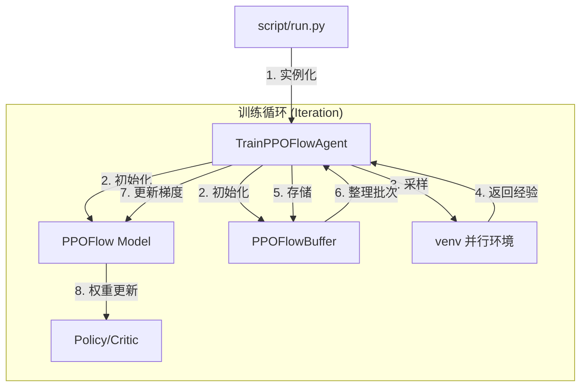

# ReinFlow 项目架构与启动全指南

本指南旨在帮助您从零开始配置环境、下载必要资产并启动 ReinFlow 训练。完成以下步骤后，您将能够复现论文中的实验结果。

---

## 🛠️ 第一部分：环境配置 (从零开始)

如果您刚刚 `git clone` 了本项目，请按照以下顺序执行操作：

### 1. 基础依赖与相关库安装
ReinFlow 依赖于多个外部仿真引擎和算法库。

*   **MuJoCo 210**: 
    1.  下载 `mujoco210` Linux 二进制文件并解压到 `~/.mujoco/mujoco210`。
    2.  设置环境变量：`export LD_LIBRARY_PATH=$LD_LIBRARY_PATH:$HOME/.mujoco/mujoco210/bin`。
*   **mjrl (Franka Kitchen 必需)**:
    1.  克隆 [mjrl](https://github.com/aravindr93/mjrl) 仓库。
    2.  在 mjrl 目录下运行 `pip install -e .`。
*   **Robomimic & Robosuite**:
    1.  参考 `installation/reinflow-setup.md` 安装特定版本的 `robomimic` 和 `robosuite`。

### 2. 创建 Conda 环境
```bash
conda create -n reinflow python=3.8 -y
conda activate reinflow
pip install -e .  # 以可编辑模式安装 ReinFlow 本身
```

### 3. 设置路径变量 (关键)
项目使用环境变量来定位数据和日志。请运行内置脚本或手动导出：
```bash
# 运行脚本会引导您设置路径并将其写入 ~/.bashrc
bash ./script/set_path.sh
# 之后务必执行：
source ~/.bashrc
```

---

## 📦 第二部分：下载必要资产 (Assets)

ReinFlow 的微调 (Fine-tuning) 流程依赖于 **预训练权重** 和 **归一化数据**，这些文件不包含在 Git 仓库中。

### 1. 归一化统计数据 (Normalization Data)
所有的配置文件都包含类似 `normalization_path: ${oc.env:REINFLOW_DATA_DIR}/gym/${env_name}/normalization.npz` 的路径。
*   **获取方式**: 运行预训练脚本会自动生成，或者从官方提供的资源包中下载并放入 `${REINFLOW_DATA_DIR}` 对应目录下。

### 2. 预训练权重 (Pre-trained Checkpoints)
微调需要加载一个已有的 Baseline。
*   **放置路径**: 请确保您的 `.pt` 权重文件放在配置文件中 `base_policy_path` 指定的位置。
*   **默认配置示例**: 如果使用的是 `ant-v2`，路径通常为 `${REINFLOW_LOG_DIR}/gym/pretrain/ant-v2/ReFlow/.../checkpoint/state_50.pt`。

---

## 🚀 第三部分：启动训练实验

在激活 `reinflow` 环境并确保路径变量正确后，使用以下命令：

### 方案 A：基于状态控制 (D4RL / Gym)
```bash
python script/run.py \
    --config-dir=cfg/gym/finetune/ant-v2 \
    --config-name=ft_ppo_reflow_mlp \
    wandb=null device=cuda:0 sim_device=cuda:0
```

### 方案 B：机械臂操作 (Franka Kitchen)
```bash
python script/run.py \
    --config-dir=cfg/gym/finetune/kitchen-mixed-v0 \
    --config-name=ft_ppo_shortcut_mlp \
    wandb=null device=cuda:0 sim_device=cuda:0
```

### 方案 C：基于视觉输入 (Robomimic)
```bash
python script/run.py \
    --config-dir=cfg/robomimic/finetune/square \
    --config-name=ft_ppo_reflow_mlp_img \
    wandb=null device=cuda:0 sim_device=cuda:0
```

---

# 🏗️ 第四部分：项目架构说明

ReinFlow 采用模块化设计，结合 [Hydra](https://hydra.cc/) 实现算法与环境解耦。

## 1. 核心流程图



## 2. 关键组件索引

| 功能模块 | 关键类/函数 | 文件路径 |
| :--- | :--- | :--- |
| **训练循环** | `TrainPPOFlowAgent.run` | `agent/finetune/reinflow/train_ppo_flow_agent.py` |
| **PPO+FM 损失**| `PPOFlow.loss` | `model/flow/ft_ppo/ppoflow.py` |
| **ODE 求解器** | `PPOFlow.get_actions` | `model/flow/ft_ppo/ppoflow.py` |
| **网络定义** | `FlowMLP` | `model/flow/mlp_flow.py` |
| **轨迹缓存** | `PPOFlowBuffer` | `agent/finetune/reinflow/buffer.py` |
