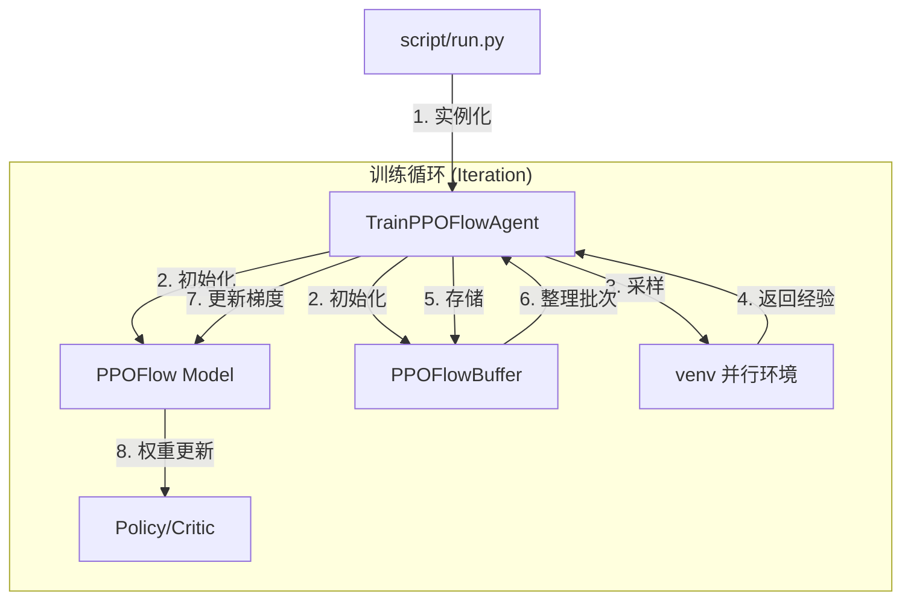

# ReinFlow 项目架构与启动全指南

本指南旨在帮助您快速配置环境、下载必要资产并启动 ReinFlow 训练。完成以下步骤后，您将能够复现论文中的实验结果。

---

## � 快速启动 (三步通关)

如果您刚刚 `git clone` 了本项目，可以直接使用以下简化流程：

### 1. 安装环境与所有依赖
现在的 `pip install` 会自动处理包括 `mjrl` 在内的所有复杂依赖。
```bash
conda create -n reinflow python=3.8 -y
conda activate reinflow
pip install -e .  # 这将一键安装 ReinFlow 及其所有外部 Git 依赖 (如 mjrl)
```

### 2. (可选) 自定义路径与资产
**路径优先级逻辑**：
*   **环境变量优先**：如果您在 `~/.bashrc` 中设置了 `REINFLOW_DATA_DIR`（例如指向 `/mnt/d/assets`），程序会优先读取。
*   **自动默认值**：如果没有设置环境变量，程序会自动在项目根目录下寻找 `data/` 和 `log/`。

**资产自动补齐**：
代码自带自动化下载功能。如果本地缺少必要的预训练权重或归一化数据，`script/run.py` 会尝试自动从云端拉取。

### 3. 直接启动训练
在激活环境后，您可以直接运行以下命令：
```bash
# 示例 1：使用默认参数启动 (Ant 环境)
python script/run.py --config-name=gym/finetune/ant-v2/ft_ppo_reflow_mlp

# 示例 2：使用命令行参数覆盖路径与 W&B
python script/run.py \
    --config-name=gym/finetune/ant-v2/ft_fpo_reflow_mlp \
    log_dir=my_custom_log \
    data_dir=my_custom_data \
    wandb=online

# 示例 3：启动 Robomimic 图像任务 (Can 环境)
# 现在可以直接启动，程序会自动使用项目根目录下的 log/ 和 data/ 文件夹
python script/run.py --config-name=robomimic/finetune/can/ft_ppo_reflow_mlp_img

# 示例 4：运行 FPO 初始噪声探索 (Adaptive Std) 的对比实验
# 该脚本会自动比较不同初始噪声 std 策略对训练的影响
bash script/run_fpo_init_std_comparison_exp.sh
```

---

## 🚀 核心更新：Robomimic 与 图像强化学习 (Visual RL)

本项目现已全面适配 **Robomimic 图像观测** 任务：
*   **图像渲染修复**：自动识别环境并启用高效的 EGL 硬件加速渲染。
*   **观测一致性**：修复了 `RobomimicImageWrapper` 中的数据溢出（Double-Scaling）Bug，确保预训练模型能够正确识别图像。
*   **自动路径管理**：即使未手动运行 `set_path.sh`，系统也会自动在当前目录下建立 `data/` 和 `log/` 结构。

## 🧪 算法实验室：FPO 初始噪声探索 (`fpo_init_std`)

基于 FPO 算法的新扩展实现：
*   **动态噪声 (Adaptive Std)**：依据 Value 网络的前馈评价，动态调整 CFM 初态的噪声标准差 `std`。
*   **对比实验**：利用 `run_fpo_init_std_comparison_exp.sh` 可一键启动同步 (Sync) 与 非同步 (No-Sync) 策略的基准测试。

---

## 🛠️ 进阶：环境与路径管理 (传统方式)

如果您需要手动管理路径或资产，可以参考以下细节：

### 1. 基础引擎安装
*   **MuJoCo 210**: 需解压至 `~/.mujoco/mujoco210` 并配置 `LD_LIBRARY_PATH`。
*   **路径配置脚本**: 运行 `bash ./script/set_path.sh` 可手动指定 Data/Log 存放位置。

### 2. 下载必要资产 (Assets)
ReinFlow 的微调 (Fine-tuning) 流程依赖于 **预训练权重** 和 **归一化数据**，这些文件不包含在 Git 仓库中。
*   **归一化统计数据 (Normalization Data)**: 路径通常为 `${REINFLOW_DATA_DIR}/gym/${env_name}/normalization.npz`。
*   **预训练权重 (Pre-trained Checkpoints)**: 请确保您的 `.pt` 权重文件放在配置文件中 `base_policy_path` 指定的位置。

### 3. Weights & Biases 实验备注
本项目原生集成了自动给 wandb run 附加详细描述（Notes）的功能，以方便比较相似名称下不同配置的跑分结果：
* 您只需在项目根目录（即 `script/` 文件夹所在目录）新建或修改 `notes.txt`。
* 在执行任何带有 `wandb=online` 开启的训练脚本时，此文件的文字将被抓取并呈现在该运行大盘中的 Overview 面板下。

---

# 🏗️ 第四部分：项目架构说明

ReinFlow 采用模块化设计，结合 [Hydra](https://hydra.cc/) 实现算法与环境解耦。

## 1. 核心流程图



## 2. 关键组件索引

| **训练循环 (PPO)** | `TrainPPOFlowAgent.run` | `agent/finetune/reinflow/train_ppo_flow_agent.py` |
| **训练循环 (FPO)** | `TrainFPOFlowAgent.run` | `agent/finetune/reinflow/train_fpo_flow_agent.py` |
| **PPO+FM 损失**| `PPOFlow.loss` | `model/flow/ft_ppo/ppoflow.py` |
| **FPO+FM 损失**| `FPOFlow.loss` | `model/flow/ft_ppo/fpoflow.py` |
| **动作生成流程** | `PPOFlow.get_actions` | `model/flow/ft_ppo/ppoflow.py` |
| **网络定义** | `FlowMLP` | `model/flow/mlp_flow.py` |
| **轨迹缓存** | `PPOFlowBuffer` | `agent/finetune/reinflow/buffer.py` |
