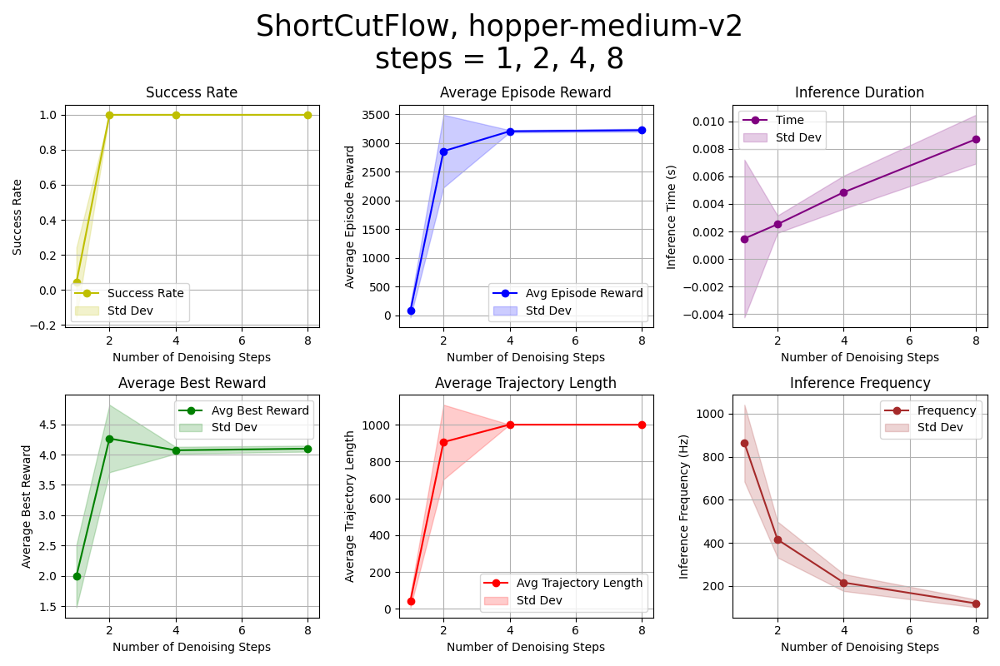

# Your Friendly Guide to Reproducing Our Experiments

Welcome! This guide will walk you through setting up and running experiments. 

It’s split into clear steps: getting datasets, downloading checkpoints, running experiments, and some handy tips. Let’s make this as smooth as possible. 

## 📂 Before you begin...

To avoid import errors and ensure smooth execution, run all commands from the root directory of the ReinFlow repository.

Your directory should look like this:

```bash
ReinFlow/
├── agent/
├── cfg/
├── script/
├── util/
└── ...
```
Please double-check that your working directory matches this structure.

## 1. Getting and Preparing Datasets for Pre-training
**Should I read this section?**
* If you wish to reproduce our pre-training results, or train an offline RL agent such as FQL, please read this section and download the pre-training data first. 
* If you want to add your own environment, train a model from scratch, and then fine-tune it, this section  is also*  helpful for your understanding of this repository. 
* If you only want to fine-tune our pre-trained checkpoints with online RL methods, feel free to skip this section. 

### OpenAI Gym: State-Based Locomotion Datasets

For OpenAI Gym, you’ve got two dataset options: D4RL’s version (our top pick) and DPPO’s version (older and less recommended). Here’s how to handle them.

#### D4RL’s Version (Recommended)

- **Option 1: Grab Processed Data Automatically**
  - Use the pre-training command with `use_d4rl_dataset=True` to download `train.npz` and `normalization.npz` files effortlessly.
  - Example for `walker2d-medium-v2`:
    ```bash
    python script/run.py --config-dir=cfg/gym/pretrain/walker2d-medium-v2 --config-name=pre_reflow_mlp
    ```
  - Check Section 3.1 for more details.

- **Option 2: Process Data Manually**
  - This works only for `hopper`, `walker2d`, and `ant`.
  - Steps:
    1. Download raw `.hdf5` files from Hugging Face:
       ```bash
       wget https://huggingface.co/datasets/imone/D4RL/resolve/main/hopper_medium-v2.hdf5
       wget https://huggingface.co/datasets/imone/D4RL/resolve/main/walker2d_medium-v2.hdf5 
       wget https://huggingface.co/datasets/imone/D4RL/resolve/main/ant_medium_expert-v2.hdf5
       ```
    2. Peek inside the `.hdf5` files:
       ```bash
       # Check out the data structure of your .hdf5 file
       python data_process/read_hdf5.py --file_path=<PATH_TO_YOUR_HDF5> 
       ```
    3. Convert to `.npz` and normalize the expert demos:
       ```bash
       # Transform .hdf5 to .npz and scale demos to [-1,1]
       python data_process/hdf5_to_npz.py --data_path=<PATH_TO_YOUR_HDF5>  
       # Outputs description.log and normalization.npz in the same folder
       # Optional: tweak --max_episodes (default: all) and --val_split (default: 0.0)
       ```
    4. Inspect your new `.npz` files:
       ```bash
       # Explore the processed .npz or read description.log
       python data_process/read_npz.py --data_path=normalization.npz
       ```
    5. Move the files to `/data/gym/<TASK_NAME>`.

#### DPPO’s Version (Deprecated)

- Downloads automatically with `use_d4rl_dataset=False`, but we suggest sticking to D4RL for consistency.
- Example:
  ```bash
  python script/run.py --config-dir=cfg/gym/pretrain/walker2d-medium-v2 --config-name=pre_reflow_mlp device=cuda:0 sim_device=cuda:0
  ```
- **Heads Up:** 
  - Use DPPO’s dataset only to match their exact results. 
  - For broader compatibility with D4RL-based research, go with D4RL’s version. 
  - If using both, store them separately and update `train_dataset_path` and `normalization_path` in your commands.

### Franka Kitchen: State-Based Multitask Manipulation Datasets

- Uses D4RL’s datasets (complete, mixed, or partial observations) via DPPO’s approach.
- Run pre-training commands, and the data downloads and normalizes itself—easy! See Section 3.1 for more.

### Robomimic: Pixel-Based Manipulation Datasets

- Relies on DPPO’s simplified Robomimic pixel datasets.
- Pre-training commands handle downloading and normalizing automatically. Check Section 3.1.
- **Note:** DPPO’s data is simpler and smaller than official Robomimic data. Training on the official stuff takes bigger models and more time but boosts pre-trained success rates.

---

## 2. Downloading Pre-trained Checkpoints

Simply run the fine-tuning scripts and the checkpoints will be automatically downloaded. 


## 3. Running the Experiments
Since we support too many experiments and algorithms, this document will not record all of the possible commands. We will only show some examples and the other settings follow our listed command patterns. 

### 3.1 Pre-training

Pre-training trains policies using offline datasets and these checkpoint will be used for fine-tuning. 
You can skip this part if you want to use our pre-trained checkpoints, but you can also train your own following our guide. 
Here’s how it works for some environments, under varying settings. Feel free to change the model class, environment and task names according to your need. 

#### OpenAI Gym

- **Pre-train a DDPM Policy in `walker2d`:**
  ```bash
  # Train a DDPM policy for walker2d with GPU support and periodic testing
  python script/run.py --config-dir=cfg/gym/pretrain/walker2d-medium-v2 --config-name=pre_diffusion_mlp device=cuda:0 sim_device=cuda:0 test_in_mujoco=True
  # `device`: GPU for computations; `sim_device`: GPU for rendering (set to null if no EGL support)
  # `test_in_mujoco=True`: Tests policy every `test_freq` steps
  ```

- **Pre-train a 1-ReFlow Policy in `Humanoid-v3` Offline:**
  ```bash
  # Train a 1-ReFlow policy offline—great for spotty internet
  python script/run.py --config-dir=cfg/gym/pretrain/humanoid-medium-v3 --config-name=pre_reflow_mlp wandb.offline_mode=True
  # `wandb.offline_mode=True`: Keeps logging local if online sync isn’t an option
  ```

- **Pre-train a Shortcut Policy in `Robomimic square`:**
  ```bash
  # Train a Shortcut policy with denoising steps up to 20 (uses powers of 2: 1, 2, 4, 8, 16)
  python script/run.py --config-dir=cfg/robomimic/pretrain/square --config-name=pre_shortcut_mlp denoising_steps=20
  # `denoising_steps`: Max steps for distillation; uses powers of 2 below this
  ```

#### Franka Kitchen and Robomimic

- Commands are similar to Gym’s, just swap the config paths:
  - Franka Kitchen: `--config-dir=cfg/gym/pretrain/kitchen-mixed-v0`
  - Robomimic: `--config-dir=cfg/robomimic/pretrain/transport`
- Update `--config-name` to match the config file names in those directories.

### 3.2 Fine-tuning

Fine-tuning tweaks pre-trained policies with online RL. Check out these examples.

- **DDPM Policy in Franka Kitchen with DPPO:**
  ```bash
  python script/run.py --config-dir=cfg/gym/finetune/kitchen-partial-v0 --config-name=ft_ppo_diffusion_mlp seed=3407
  ```

- **Visual-Input DDIM Policy in Robomimic with DPPO:**
  ```bash
  python script/run.py --config-dir=cfg/robomimic/finetune/square --config-name=ft_ppo_diffusion_mlp_img
  ```

- **1-ReFlow Policy in OpenAI Gym with ReinFlow:**
  ```bash
  python script/run.py --config-dir=cfg/gym/finetune/ant-v2 --config-name=ft_ppo_reflow_mlp_img min_std=0.08 max_std=0.16 train.ent_coef=0.03 
  ```

- **Visual-Input Shortcut Policy in Robomimic with ReinFlow:**
  ```bash
  python script/run.py --config-dir=cfg/gym/finetune/ant-v2 --config-name=ft_ppo_reflow_mlp_img denoising_steps=1 ft_denoising_steps=1 
  ```

#### Troubleshooting

- **Training Crashed? Resume It:**
  ```bash
  # Pick up where you left off after a crash
  ENV_NAME=walker2d-v2 ALG_NAME=difussion \
  python script/run.py --config-dir=cfg/gym/finetune/${ENV_NAME} --config-name=ft_ppo_${ALG_NAME}_mlp \
  resume_path=CHECKPOINT_THAT_FAILED.pt
  ```
  - This make you continue training for another `train.n_train_itr` rounds, restoring everything from the checkpoint. 
  - If you meet the error that there is no `resume_path` in the config file, just append it. 
  - Currently, we only support resuming from pre-trained or fine-tuned checkpoints obtained via ReinFlow, and the DPPO checkpoints trained with `agent/finetune/reinflow/train_ppo_diffusion_img_agent.py` or `agent/finetune/reinflow/train_ppo_diffusion_agent.py`. 

- **Want to Change a Pre-trained Policy?**
  Simply specify it in your prompt:
  ```bash
  python script/run.py --config-dir=cfg/robomimic/finetune/transport --config-name=ft_ppo_shortcut_mlp \
  base_policy_path=NEW_PRETRAINED_POLICY.pt \
  ```

- **Want to Use a Policy Trained on Different Expert Data?**
  Don't forget to update the normalization path to your new expert data. A mismatched normalization will make your curves look super wierd! 
  ```bash
  python script/run.py --config-dir=cfg/robomimic/finetune/transport --config-name=ft_ppo_shortcut_mlp \
  device=cuda:0 sim_device=cuda:1 \
  base_policy_path=NEW_PRETRAINED_POLICY.pt \
  normalization_path=PATH_TO_YOUR_NEW_EXPERT_DATA_DIRECTORY/normalization.npz \
  ```

- **How to Specify a WandB Name Before Training Starts ? (When Doing Parameter Sweep)**
  ```bash
  # Name your run and log it in the background
  nohup python script/run.py --config-dir=cfg/gym/finetune/kitchen-complete-v0 --config-name=ft_ppo_shortcut_mlp device=cuda:0 sim_device=cuda:0 denoising_steps=1 ft_denoising_steps=1 seed=3407 \
  name=THE_NAME_I_LIKE_seed3407 \
  > ./ft_kitchen_complete_v0_shortcut_denoise_step_1_seed3407.log 2>&1 &
  ```

- **My GPU is Not Fast Enough and I Want to Run Overnight, How to do it?**
  The most stable method is to run in the background and output all logs to a certain file. 
  ```bash
  # Run in the background and save logs to a custom file
  nohup python script/run.py --config-dir=cfg/gym/finetune/kitchen-complete-v0 --config-name=ft_ppo_shortcut_mlp > ./MY_CUSTOM_LLOG_FILE.log 2>&1 &
  ```


#### Quick Tips for Fine-tuning Flow Policies

- **Let It Fail Sometimes:**
  - Use enough rollout steps to mix successes and failures. Too-short trajectories can trick the critic into bad decisions.
- **Tweak Critic Warmup:**
  - Adjust warmup iterations or even initializatoin based on how well your initial policy performs.


### 3.3 Evaluating

To evaluate pre-trained policies across various denoising steps, run this command in your terminal: 
```bash
python script/run.py --config-dir=cfg/robomimic/eval/transport --config-name=eval_reflow_mlp_img base_policy_path=PATH_TO_THE_POLICY_TO_EVALUATE denoising_step_list=[1,2,4,5,8,16,32,64,128] load_ema=False
```
- **What You Get:** Six plots showing episode reward, success rates, episode length, inference frequency, duration, and best reward, with shaded areas for standard deviation.
- **Tips:**
  - `load_ema=True` for pre-trained policies; `False` for fine-tuned ones.
  - Can’t set `denoising_step_list`? Add it to your config file.
  - Clear other processes on your machine for accurate timing.
- **Output:** Saves a `.png` plot and data files for later use. Example: 
<div align="center">
  
</div>

- **What to record videos?** For Gym, Robomimic, and Franka Kitchen, you can change the `self.record_video=True` in the corresponding evaluation script and set `self.record_env_index` to the environment id that you wish to record. You can also specify the height and width of your video by changing the values of `self.frame_width` and `self.frame_height`. Then after running the evaluation script, you will see a .mp4 file under your output directory along with your plot! Below, we provide an example video (converted to .gif), which records Fine-tuned Shortcut Flow in Robomimic-can environment, inferred at 1 denoising steps. 

<div align="center">
  
</div>

<!-- <video width="1080" height="1920" controls>
  <source src="sample_figs/ShortCutFlow_can_step1_1080_1920.mp4" type="video/mp4">
  Your browser does not support the video tag.
</video> -->

- **Warning** If you trained a flow matching policy with ReinFlow, typically we will clip the denoised actions during fine-tuning. Therefore, we recommend you turn on `self.clip_intermediate_actions=True` in your evaluation script. Otherwise the reward may drop. 


### 3.4 Sensitivity Analysis
* Change the sampling distribution for 1-ReFlow policies. 

Currently, we support using beta distribution or logit normal distribution. 
Just change `model.sample_t_type=beta` or `model.sample_t_type=logitnormal` in your pre-training commands. 

We provide the Google Drive link to the 1-ReFlow checkpoints trained in Square with [beta](https://drive.google.com/file/d/1d2oDejHLzkzSOuryvDKBZbJlVFBeo3ZQ/view?usp=drive_link) and [logitnormal](https://drive.google.com/file/d/1W-RH23OZMpVW5Ijo2ZmsYIlgVTsXuSfD/view?usp=drive_link)distributions. 


## 4. Making the Most of This Repo

### WandB Logging

- **No Internet? No Problem:**
  - Use `wandb.offline_mode=True` and sync later with `wandb sync <your_wandb_offline_file>`.
  - You can also sync all the offline data in a batch, for example, to sync all the offline wandb runs in 2025/05/10, run this in your terminal: 
    `for dir in ./wandb_offline/wandb/offline-run-20250510*; do wandb sync "${dir}"; done`
- **Skip WandB Logging to save memory:**
  - Set `wandb=null` will stop creating a WandB logging. 
- **I Turned wandb=null But Later I Wanted To Recover These Data:**
  - No worries. Even if your `wandb=null`, we still automatically save all training record for all runs dto a `.pkl` file. You can always recover your WandB run later with `util/pkl2wandb.py`.

### Managing Memory

- **My cuda is out of memory:**
  - Reduce `env.n_envs` and bump up `train.n_steps` to keep total steps consistent (`n_envs x n_steps x act_steps`).
  - Make `train.n_steps` a multiple of `env.max_episode_steps / act_steps`.
  - Furniture-Bench uses IsaacGym on one GPU.

### Switching Policies or Resuming

- **Custom Pre-trained Policy:**
  - Set `base_policy_path=<path>` in your command.
- **Resume Training:**
  - Add `resume_path=<checkpoint>` to your command (ensure `resume_path: null` is in your config).

### Rendering with MuJoCo

- **I want to render faster on GPUs**
  - Set `sim_device=<gpu_id>` for fast rendering.
  - No EGL? Use `sim_device=null` for slower osmesa rendering.

### Visualizing Results for Other benchmarks in DPPO:
- **Furniture-Bench:** Set `env.specific.headless=False` and `env.n_envs=1`.
- **D3IL:** Use `+env.render=True`, `env.n_envs=1`, `train.render.num=1`, and `script/test_d3il_render.py`.

